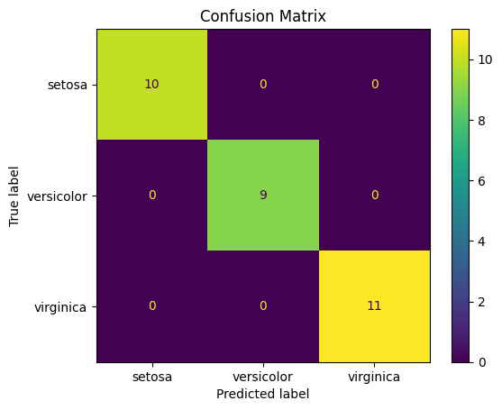
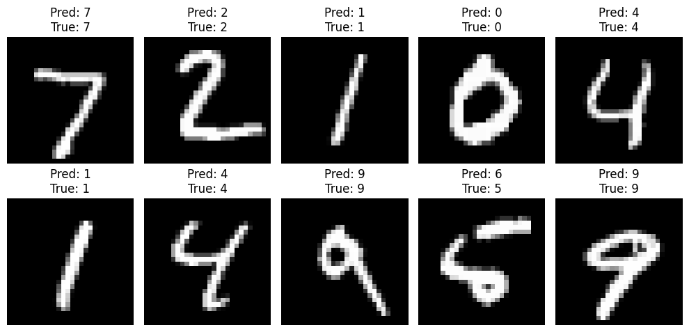

# 🧠 AI Tools Assignment: AI Tools and Applications

## Theme: "Mastering the AI Toolkit" 🛠️🧠

---

## Objective & Guidelines

This assignment evaluates your understanding of **AI tools/frameworks** and their real-world applications through a mix of theoretical and practical tasks. You’ll demonstrate proficiency in selecting, implementing, and critically analyzing AI tools to solve problems.

The assignment has three parts:
- **Theory:** Tests the theoretical understanding of AI Tools
- **Practical:** Tests the implementation skills of AI tools
- **Ethics & Optimization:** Tests ethical AI development and AI software optimization skills

**Teamwork:**
- This is a group assignment (3-5 people) to enhance teamwork and AI engineering collaboration.

### Submission Guidelines
- **Code:** Well-commented scripts/Jupyter notebooks (submit on GitHub)
- **Report:** PDF with:
  - Answers to theoretical questions
  - Screenshots of model outputs (e.g., accuracy graphs, NER results)
  - Ethical reflection
  - (Share PDF as article in Community, Peer Group Review, and include in GitHub Repo)
- **Presentation:** 3-minute video explaining your approach (all members participate; share on Community platform)

### Grading Rubric
| Criteria                  | Weight |
|--------------------------|--------|
| Theoretical Accuracy     | 30%    |
| Code Functionality & Quality | 40%    |
| Ethical Analysis         | 15%    |
| Creativity & Presentation| 15%    |

### Tools & Resources
- **Frameworks:** TensorFlow, PyTorch, Scikit-learn, spaCy
- **Platforms:** Google Colab (free GPU), Jupyter Notebook
- **Datasets:** Kaggle, TensorFlow Datasets

**Why This Matters:**
- Real-World Impact: These tools power industries from healthcare to finance.
- Skill Validation: Employers seek proficiency in TensorFlow, PyTorch, and Scikit-learn.

**Deadline:** 7 days. Showcase your AI toolkit mastery! 🚀

**Need Help?**
- Use official documentation: TensorFlow, PyTorch, spaCy
- Post questions on the LMS Community with #AIToolsAssignment
- **Pro Tip:** Test code incrementally—small wins lead to big successes! 💡

---

## 👥 Team Members

- **Mike:** [GitHub](https://github.com/MykeShale)
- **Violet:** [GitHub](https://github.com/violetwanjiru)
- **Lukhanyo:** [GitHub](https://github.com/Luu-17)
- **Tshimo:** [GitHub](https://github.com/TshimoHlapane)

---

## 🗂️ Work Division

| Member    | Responsibilities                                                                                 |
|-----------|--------------------------------------------------------------------------------------------------|
| **Mike**      | Part 2 Task 2: Deep Learning with TensorFlow (MNIST CNN), model training, accuracy evaluation, and code documentation. |
| **Violet**    | Part 2 Task 3: NLP with spaCy (NER & Sentiment), code for entity extraction and sentiment, and notebook documentation. |
| **Lukhanyo**  | Part 3: Ethics & Optimization (bias analysis, bug fixing in TensorFlow, ethical reflection), and report writing.        |
| **Tshimo**    | Part 2 Task 1: Classical ML with Scikit-learn (Iris Decision Tree), EDA, model evaluation, and Streamlit deployment.   |

---

# Part 1: Theoretical Understanding (30%)

## 1. Short Answer Questions

**Q1: Explain the primary differences between TensorFlow and PyTorch. When would you choose one over the other?**

- **TensorFlow** (by Google) uses a static computation graph (with eager mode available), is widely adopted in industry, and offers strong deployment tools (TensorFlow Lite, TensorFlow.js). It is ideal for production-ready deployment and when using pre-trained models from TensorFlow Hub.
- **PyTorch** (by Meta) uses a dynamic computation graph (imperative style), is popular in research, and is highly Pythonic and flexible for debugging and experimentation. It is preferred for fast prototyping and research workflows.
- **Choose TensorFlow** for production, mobile, or embedded deployment.
- **Choose PyTorch** for research, rapid prototyping, and when you want a more Pythonic experience.

---

**Q2: Describe two use cases for Jupyter Notebooks in AI development.**

- **Exploratory Data Analysis (EDA):** Interactively load, visualize, and transform datasets to understand data distributions and relationships.
- **Prototyping and Model Experimentation:** Train and test multiple models with live outputs and visualizations (e.g., training curves, confusion matrices), supporting collaborative and reproducible development.

---

**Q3: How does spaCy enhance NLP tasks compared to basic Python string operations?**

- spaCy provides pretrained pipelines for tokenization, part-of-speech tagging, named entity recognition (NER), and lemmatization, supporting over 60 languages.
- It is faster and more robust than basic string operations or regex, and can detect context-aware entities (like organizations or product names), tokenize grammatically, and handle multilingual text.
- Basic string operations cannot perform these advanced, context-aware, or language-specific tasks.

---

## 2. Comparative Analysis

**Compare Scikit-learn and TensorFlow:**

| Category         | Scikit-learn                        | TensorFlow                              |
|------------------|-------------------------------------|-----------------------------------------|
| Focus            | Classical ML (SVM, Trees, kNN, etc.)| Deep Learning (CNNs, RNNs, Transformers)|
| Learning Types   | Supervised, unsupervised, basic ensemble | Neural networks, custom layers, RL  |
| Complexity       | Simple APIs, great for small datasets| Handles complex models, large data      |
| Beginner-friendly| Very accessible, low learning curve  | Slightly steeper learning curve         |
| Deployment Tools | None built-in                        | TensorFlow Lite, TF Serving             |
| Community + Docs | Mature with tons of tutorials        | Strong backing and rich ecosystem       |

- Use **Scikit-learn** for small-scale tasks like churn prediction or clustering.
- Use **TensorFlow** for image recognition, speech translation, and NLP.

---

# Part 2: Practical Implementation (50%)

## Task 1: Classical ML with Scikit-learn

- **Notebook:** [Iris_Decision_Tree_Styled.ipynb](Part%202-%20Practical/Task%201%20-%20Scicit%20Iris/Iris_Decision_Tree_Styled.ipynb)
- **Dataset:** Iris Species (Kaggle)
- **Goal:** Preprocess data, train a decision tree classifier, and evaluate using accuracy, precision, and recall.
- **Results:**  
  - **Accuracy:** 1.00  
  - **Precision:** 1.00  
  - **Recall:** 1.00  
  - **Confusion Matrix:** All predictions correct for each class.
  - 

---

## Task 2: Deep Learning with TensorFlow

- **Notebook:** [mnist_cnn_model.ipynb](Part%202-%20Practical/Task%202%20-%20Tensorflow%20MNIST/mnist_cnn_model.ipynb)
- **Dataset:** MNIST Handwritten Digits
- **Goal:** Build a CNN to classify digits, achieve >95% accuracy, and visualize predictions.
- **Results:**  
  - **Test Accuracy:** 0.9887 (98.87%)  
  - **Model:** 2 Conv2D + MaxPooling layers, Dense layers, softmax output.
  - **Visualization:** Model predictions on 5 sample images are displayed in the notebook.

---

## Task 3: NLP with spaCy

- **Notebook:** [spacy_ner_sentiment.ipynb](Part%202-%20Practical/Task%203%20-%20Spacy%20NLP/spacy_ner_sentiment.ipynb)
- **Dataset:** Amazon Product Reviews (sampled)
- **Goal:** Perform NER to extract product names/brands and analyze sentiment using rule-based logic.
- **Results:**  
  - **NER:** Detected entities like "Samsung Galaxy" (ORG), "Dell" (PERSON), "Apple AirPods" (ORG), "Sony" (ORG).
  - **Sentiment:**  
    - Positive: "I love my new Samsung Galaxy! The camera quality is amazing."
    - Negative: "This laptop from Dell is awful. The battery died in just 2 hours."
    - Neutral: "The Sony headphones are just okay. Nothing special."

---

# Part 3: Ethics & Optimization (10%)

- **Notebook:** [ethics_and_debugging.ipynb](Part%203%20-%20Ethics%20Optimization/ethics_and_debugging.ipynb)

## 1. Ethical Considerations

- **Amazon Reviews Model:**
  - Rule-based sentiment may fail with sarcasm or cultural nuance.
  - Reviews may overrepresent extreme opinions.
  - Language models may favor certain brands due to training data.
- **MNIST Model:**
  - MNIST is balanced by digit but lacks handwriting diversity.
  - No representation of various scripts or writing impairments.
- **Mitigation:**  
  - Use TensorFlow Fairness Indicators or re-sample reviews by verified buyers.
  - Evaluate model performance across different sub-groups.

---

## 2. Troubleshooting Challenge

- **Buggy Code Issues:** Dimension mismatch and incorrect loss function.
- **Fix:**  
  - Use `categorical_crossentropy` for multi-class classification.
  - One-hot encode labels to match output shape.
  - After fixing, the model achieves high accuracy (e.g., 0.9706 on MNIST test set).

---

# 🚀 Bonus Task (Extra 10%)

## Deploy Your Model
- **App:** [streamlit_app.py](Deployment/streamlit_app.py)
- Use Streamlit or Flask to create a web interface for your MNIST classifier.
- Submit a screenshot and a live demo link.

---

# 📸 Screenshots
- Confusion Matrix from Iris Classifier
- Ethics & Debugging analysis output

### Confusion Matrix

### Ethics & Debugging

---

# 🧠 Group Reflection

Each member describes what they learned (1-2 sentences each):

- **Mike:** “I learned how to train and evaluate deep learning models using TensorFlow.”
- **Violet:** “This project helped me understand how NER works and how spaCy simplifies NLP.”
- **Lukhanyo:** “I learned how to debug model issues and analyze fairness in AI systems.”
- **Tshimo:** “It was exciting to build a front-end using Streamlit for our model.”

---

# 📂 GitHub Repository

🔗 Link: [https://github.com/MykeShale/AI-Toolkit-Masterclass]
